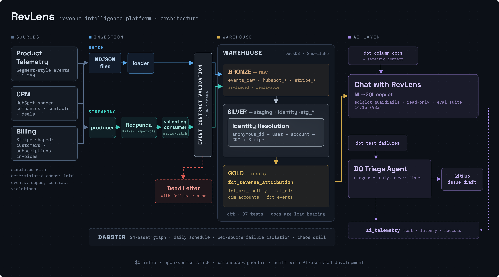

# RevLens — Revenue Intelligence Platform

**End-to-end data platform for a PLG SaaS: product telemetry + CRM + billing unified into
a governed single source of truth — with closed-loop revenue attribution, cross-device
identity resolution, contract-enforced streaming ingestion, orchestration, and
production-grade AI features (evaluated NL→SQL copilot + AI data-quality triage).**


## Architecture



```
                          ┌─ BATCH ──────────────────────────────┐
  Simulator (stand-in     │  NDJSON -> load_duckdb.py            │
  for Segment/HubSpot/    ├─ STREAMING ──────────────────────────┤     dbt (37 tests)
  Stripe; deterministic,  │  producer -> Redpanda -> consumer    │  raw ─> staging ─> identity ─> marts
  chaos-injected)         │  (contract validation in-flight,     │  (Bronze)  (Silver)         (Gold)
                          │   dead-letter quarantine)            │
                          └──────────────────────────────────────┘
  Dagster: 24-asset graph, daily schedule, chaos drill        AI: copilot + triage agent
```

- **Event contracts** (JSON Schema, versioned): violations -> dead-letter with reason, never dropped
- **Identity resolution**: anonymous_id -> user -> account -> CRM (probabilistic domain match,
  97%, tracked) + Stripe (deterministic metadata match); 12.8K pre-signup events retroactively stitched
- **Marts**: fct_revenue_attribution (closed loop: channel -> signups -> conversion -> $),
  fct_mrr_monthly (movement-classified), fct_ndr, dim_accounts
- **Orchestration**: Dagster asset graph (bronze assets isolated per source), daily 06:00,
  GitHub Actions mirror, REVLENS_CHAOS=1 failure-isolation drill
- **AI copilot** ("Chat with RevLens"): dbt-docs-grounded semantic layer, sqlglot guardrails
  (SELECT-only, marts-only, auto-LIMIT, read-only exec), every call logged to ai_telemetry
- **AI triage agent**: dbt test failure -> lineage + samples -> ranked root-cause hypotheses
  -> GitHub issue draft (diagnoses only; never fixes)

## Copilot eval journey (the honest numbers)

15-question golden set, result-equivalence grading (subset-tolerant), CI plumbing gate at 100%.
Final: **14/15 (93%)** on free local models (llama3.1:8b), $0 spend.

| stage | change | score |
|---|---|---|
| v0 baseline | 4-rule prompt | 7/15 (47%) |
| grader fix | subset-column matching (1/8 failures were grader strictness) | 8/15 (53%) |
| v2 prompt rulebook | rules + few-shots from telemetry-driven failure analysis | 12/15 (80%) — fixed all 8, **introduced 3 regressions** |
| model swap | qwen2.5-coder:7b, same prompt | 12/15 (80%) — **identical failures → systemic, not model capability** |
| semantics → dbt docs (partial) | prompt slimmed before full migration | 10/15 (67%) — migrated patterns passed; unmigrated ones returned |
| **semantics → dbt docs (complete)** | **metric usage documented on the columns themselves; prompt back to 4 stable rules** | **14/15 (93%)** |

Key findings:
1. Dominant failure mode: the model *recomputing metrics that already exist as columns*.
2. Identical failures across two independent models proved the bottleneck was the rule set,
   not model capability.
3. Business knowledge must live somewhere the model reliably sees it — the durable home is
   the dbt column docs (single source of truth for humans AND the copilot), not an
   ever-growing prompt rulebook. Docs coverage directly determined accuracy.

Known limitation: `unattributed_accounts` (1/15) still fails — the model misreads the
"(unattributed)" channel-row phrasing. Documented rather than tuned away.

## Incidents & fixes (real bugs hit during the build)

1. **CRM duplicate companies** broke account-spine uniqueness (join fan-out) -> survivorship
   rule (oldest record wins), caught by a dbt unique test
2. **Schema inference drift**: read_json_auto typed `canceled_at` differently by null density
   -> explicit try_cast; never trust inference on semi-structured sources
3. **DuckDB single-writer vs Dagster multiprocess executor**: parallel bronze assets fought
   over the file lock -> executor pinned to max_concurrent=1 (constraint disappears on Snowflake)
4. **Relative DB path in profiles.yml** produced silently-empty databases depending on cwd
   -> REVLENS_DB_PATH env var, absolute
5. **Unclosed read-only connection on the copilot's error path** crashed telemetry logging
   -> try/finally; test the failure path, not just the happy path
6. **Prompt regression**: v2 rules fixed all 8 target failures and silently broke 3 passing
   questions -> full-suite evals on every prompt change, exactly like code

## Quickstart

```bash
python3 -m venv .venv && source .venv/bin/activate
pip install -r requirements.txt
export REVLENS_DB_PATH=$PWD/revlens.duckdb
export DBT_PROFILES_DIR=$PWD/dbt/revlens/profiles
make data                                   # 6 months of synthetic world (seed=42)
python ingestion/load_duckdb.py             # bronze
cd dbt/revlens && dbt deps && dbt build && dbt docs generate && cd ../..   # silver+gold, 37 tests

# Orchestrated instead: dagster dev -f orchestration/definitions.py -> localhost:3000
# Streaming: docker compose up -d; then stream_producer.py + stream_consumer.py
# Copilot:  python ai/copilot.py "Which channel has the best conversion rate?"
# Evals:    python ai/run_evals.py
# Triage:   python ai/triage_agent.py --demo
```

## Repo map

`data_simulator/` deterministic world - `contracts/` versioned event contracts -
`ingestion/` batch loader + streaming producer/consumer + contract validator -
`dbt/revlens/` models (staging/identity/marts) + 37 tests - `orchestration/` Dagster -
`ai/` copilot, triage agent, evals, telemetry - `docs/` phase plan, Loom script
